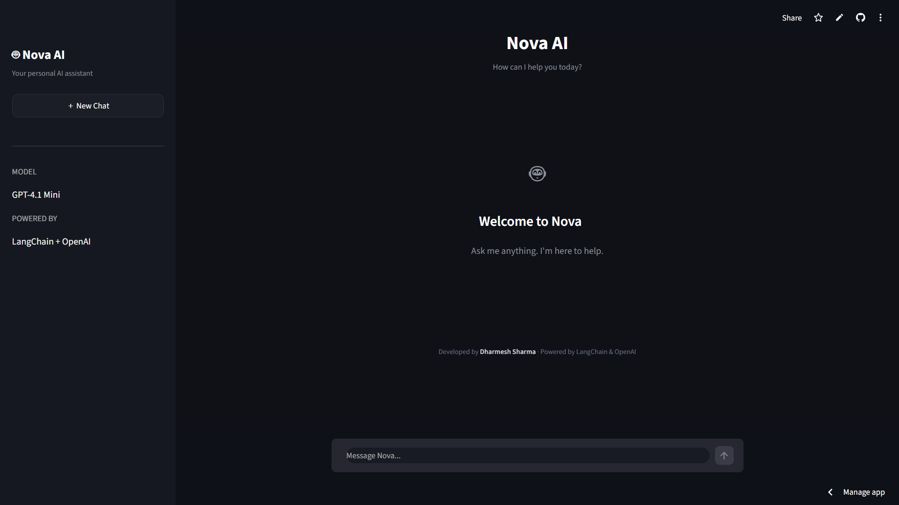

# 🤖 Nova AI

> Your personal AI assistant, built from scratch.

Nova AI is a clean and minimal AI chatbot that lets you interact with an LLM through a simple conversational interface.

I built Nova to understand how an AI-powered application works beyond just sending prompts to an API — from connecting the model to building the interface and deploying the application.

---

## ✨ Live Demo

🚀 **Try Nova AI:**  
https://deploy-juhrt5pzgbisw35yuibmth.streamlit.app/

> Note: The live demo may be temporarily limited depending on available API credits.

---

## 🖥️ Preview

<p align="center">
  
</p>

---

## ⚡ What is Nova AI?

Nova is a lightweight AI chatbot designed to provide a simple and distraction-free conversational experience.

The goal was not to build another complicated AI platform.

The goal was simple:

**Build an AI application → understand how it works → deploy it → keep improving it.**

---

## 🧠 Tech Stack

| Technology | Purpose |
|------------|---------|
| 🐍 Python | Core application logic |
| 🔗 LangChain | LLM application framework |
| 🤖 OpenAI | AI model |
| 🎨 Streamlit | Web interface |
| 🚀 Streamlit Cloud | Deployment |

---

## 🎯 Key Features

- 💬 Conversational AI interface
- 🤖 OpenAI-powered responses
- 🔗 LangChain integration
- 🌙 Clean dark UI
- 🆕 New chat functionality
- 📱 Simple and responsive interface
- ☁️ Deployed online

---

## 🏗️ How It Works

```text
        User
          │
          ▼
     Nova AI UI
     (Streamlit)
          │
          ▼
       LangChain
          │
          ▼
      OpenAI Model
          │
          ▼
       AI Response
          │
          ▼
      Nova AI UI
📂 Project Structure
Nova-AI/
│
├── asset/
│   └── screenshot.png
│
├── app.py
├── requirements.txt
├── .env
└── README.md
⚙️ Run Locally
1. Clone the repository
git clone https://github.com/YOUR-USERNAME/YOUR-REPOSITORY.git
cd Nova-AI
2. Create a virtual environment
python -m venv .venv
3. Activate the environment

Windows:

.venv\Scripts\activate
4. Install dependencies
pip install -r requirements.txt
5. Add your API key

Create a .env file:

OPENAI_API_KEY=your_api_key_here
6. Run Nova
streamlit run app.py
💡 Why I Built This

Building Nova was part of my journey toward becoming an AI Engineer.

Instead of only learning concepts theoretically, I wanted to turn what I was learning into something that actually runs as a real application.

This project helped me practice:

LLM integration
LangChain
API handling
Streamlit
Environment variables
Application deployment
Debugging real-world issues
🚧 What's Next?

Nova is just Version 1.

Some things I want to explore in future versions:

🧠 Better conversation memory
📄 Document / PDF chatting
🎙️ Voice interaction
🛠️ AI tools
🔍 Web search capabilities
⚡ Better UI/UX
🔐 Improved security
🚀 More advanced agentic capabilities
👨‍💻 Developer

Dharmesh Sharma

AI Engineering Student | Python | Machine Learning | Generative AI

⭐ If you like the project

Feel free to explore the code, try the live demo, or connect with me.

Nova AI — Version 1.0 🤖


### Ek important cheez bhai 👇

GitHub mein structure exactly aisa rakh:

```text
Your-Repo/
│
├── asset/
│   └── screenshot.png   ← TERI IMAGE
│
├── app.py
├── requirements.txt
└── README.md

Aur README mein ye:


Screenshot.png ko rename karke screenshot.png kar dena, taaki README ke path se exactly match kare.

Live demo ko README mein clickable rakhne ke liye:

🚀 Try Nova AI — Live Demo
